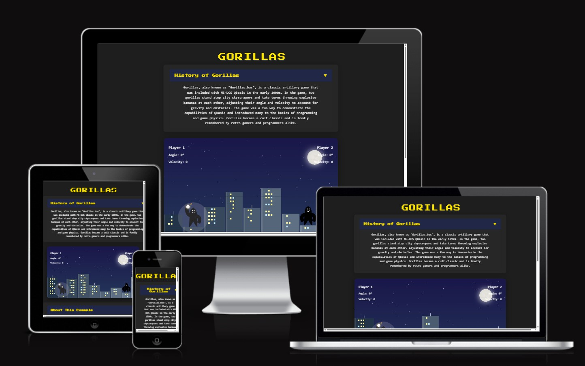

# Gorilla Game

[](LICENSE)
[](https://mcbonuss.github.io/p2Java-script-game/)
[](https://github.com/McBonuss/p2Java-script-game/issues)
[](https://github.com/McBonuss/p2Java-script-game/commits/main)

A modern, browser-based remake of the classic QBasic "Gorillas" artillery game.  
Challenge a friend on a beautiful night skyline—now with animated gorillas, dynamic cityscapes, and a polished, mobile-friendly UI.

---

## Table of Contents

1. [User Experience (UX)](#user-experience-ux)
    1. [Project Goals](#project-goals)
    2. [User Stories](#user-stories)
    3. [Color Scheme](#color-scheme)
    4. [Typography](#typography)
    5. [Wireframes](#wireframes)
2. [Features](#features)
3. [Demo](#demo)
4. [Screenshots](#screenshots)
5. [Getting Started](#getting-started)
    - [Prerequisites](#prerequisites)
    - [Installation](#installation)
    - [Running Locally](#running-locally)
    - [Deployment](#deployment)
6. [Game Architecture](#game-architecture)
7. [File Structure](#file-structure)
8. [Main Components](#main-components)
9. [Gameplay](#gameplay)
10. [Extensibility & Customisation](#extensibility--customisation)
11. [Recent Changes & Updates](#recent-changes--updates)
12. [Technologies Used](#technologies-used)
13. [Testing](#testing)
14. [Browser Compatibility](#browser-compatibility)
15. [Accessibility](#accessibility)
16. [Known Issues](#known-issues)
17. [Troubleshooting & FAQ](#troubleshooting--faq)
18. [Future Features](#future-features)
19. [Contributing](#contributing)
20. [Changelog](#changelog)
21. [Credits & Acknowledgements](#credits--acknowledgements)
22. [Support](#support)
23. [License](#license)

---

## User Experience (UX)

### Project Goals

- Deliver a fun, nostalgic, and visually appealing remake of the classic QBasic Gorillas game.
- Provide a responsive, accessible, and intuitive experience for both desktop and mobile users.
- Make the codebase easy to understand, extend, and maintain for future developers.

### User Stories

- As a player, I want to play Gorillas in my browser, on any device.
- As a player, I want clear, simple controls for aiming and throwing.
- As a player, I want to see who is winning and get feedback when a round ends.
- As a player, I want to read about the history of Gorillas and how to play.
- As a developer, I want to easily understand, test, and extend the codebase.

### Color Scheme

The game uses a night-sky palette: deep blues and purples for the background, yellow for highlights and headings, and subtle gradients for depth. Building windows and the moon add pops of color.

### Typography

- **Headings & UI:** [Press Start 2P](https://fonts.google.com/specimen/Press+Start+2P) (Google Fonts) for a retro, pixel-art feel.
- **Body:** Same font for consistency and theme.

### Wireframes

Wireframes were sketched to ensure a clear layout for the game area, info panels, and expandable cards. The design prioritizes clarity, accessibility, and mobile responsiveness.

---

## Features

- **Responsive Design:** Adapts to all screen sizes, including mobile and tablets.
- **Procedural Cities:** Each game features a unique skyline.
- **Animated Gorillas:** Improved proportions and expressive arms.
- **Intuitive Controls:** Drag-and-release to aim and throw; touch and mouse supported.
- **Night Sky:** Gradient background, static stars, and a glowing moon.
- **Building Variety:** 3D effects, static windows, and rooftop antennas.
- **Celebration Overlay:** Custom “Congratulations” screen for the winner.
- **Modern UI:** Floating, expandable cards for "How to Play", "History", and "About".
- **Accessibility:** ARIA, skip links, keyboard navigation for cards.
- **Zero Dependencies:** All code is vanilla JS/CSS/HTML.
- **Easy to Fork & Extend:** Modular, well-commented code.

---

## Demo

[▶️ **Play Gorilla Game (GitHub Pages)**](https://mcbonuss.github.io/p2Java-script-game/)

---

## Screenshots




---

## Getting Started

### Prerequisites

- A modern web browser (Chrome, Firefox, Edge, Safari)
- _(Optional)_ VSCode Live Server extension for local dev

### Installation

```bash
git clone https://github.com/McBonuss/p2Java-script-game.git
cd p2Java-script-game
```

### Running Locally

Open `index.html` in your browser, or use Live Server for auto-refresh:

```bash
# Mac
open index.html

# Windows
start index.html

# Linux
xdg-open index.html
```

### Deployment

Push to the main branch.

Enable GitHub Pages in your repository settings (root).

Your game will be live at:  
<https://mcbonuss.github.io/p2Java-script-game/>

---

## Game Architecture

- **Game State:** All runtime data is stored in a single state object.
- **Procedural Generation:** Buildings and windows are randomly generated.
- **Rendering:** All visuals (city, gorillas, bomb) are handled via Canvas 2D API.
- **Input:** Mouse/touch events for aiming; responsive design auto-adjusts controls.
- **UI:** Info cards and overlays use semantic HTML/CSS and are ARIA-labelled for accessibility.
- **Game Loop:** Uses requestAnimationFrame for smooth animation and physics stepping.
- **Collision Detection:** Simple circle-to-circle for gorilla/bomb; rectangle for buildings.

The game logic, rendering, and UI code are clearly separated for easy onboarding and extension.

---

## File Structure

```text
/
├── index.html
├── css/
│   └── style.css
├── assets/
│   ├── ReadMEImages/
│   └── js/
│       └── scripts.js
├── screenshots/
├── README.md
├── LICENSE
```

---

## Main Components

- **index.html:** Game canvas and all UI elements; also includes info overlays and cards.
- **css/style.css:** Main styling for layout, UI, and canvas visuals.
- **assets/js/scripts.js:** All gameplay, rendering, input, and logic.
- **assets/ReadMEImages/:** Documentation assets/screenshots.
- **screenshots/:** (Add gameplay screenshots and GIFs here.)

---

## Gameplay

**Goal:**  
Hit your opponent’s gorilla with the banana to win!

**How to Play:**

- Click and drag the banana to set angle/velocity.
- Release to throw.
- The bomb’s arc is affected by gravity; aim carefully over (or around) buildings.
- The correct arm raises when aiming—both arms when celebrating!
- Click “New Game” to reset and play again.

**Mobile:**  
Rotate your device to landscape for the best experience.

---

## Extensibility & Customisation

**Add new features:**

- Wind or weather: Modify the bomb’s physics in `moveBomb()`.
- More players: Refactor the `state.currentPlayer` logic and UI.
- Power-ups: Add objects to the city and handle collisions in the main loop.
- AI Opponent: Implement a simple bot for single-player.

**Customise visuals:**

- Tweak colors, building shapes, or add new sprites in `drawBuildings()` or `drawGorillaBody()`.
- Replace the night sky and moon with your own background in `drawBackground()`.

**Add sounds:**

- Hook into bomb throw and collision events to play sounds.

All main code is in `/assets/js/scripts.js` and is thoroughly commented for ease of navigation.

---

## Recent Changes & Updates

- **Night sky** with a realistic moon and static stars.
- **More building variety**, 3D shading, rooftop details.
- **Improved gorilla body/face proportions and animation.**
- **Enhanced celebration overlay.**
- **Static, non-flickering windows and stars** for a polished look.
- **Full ARIA/keyboard accessibility** on expandable cards.
- **Debug/development code removed** for production.
- **Updated and extended documentation.**

---

## Technologies Used

- **Languages:** HTML5, CSS3, JavaScript (ES6)
- **Dev Tools:** VSCode, Chrome DevTools
- **Fonts:** Google Fonts (Press Start 2P for retro feel)
- **Version Control & Hosting:** GitHub, GitHub Pages

---

## Testing

### Testing User Stories

- As a player, I want to play Gorillas in my browser, on any device.
  - Tested on Chrome, Firefox, Edge, and Safari on both desktop and mobile devices. The game loads and is playable on all.
- As a player, I want clear, simple controls for aiming and throwing.
  - Mouse and touch drag tested for aiming and throwing; both work as expected.
- As a player, I want to see who is winning and get feedback when a round ends.
  - The winner overlay appears after a successful hit; info panels update correctly.
- As a player, I want to read about the history of Gorillas and how to play.
  - Expandable cards for "History" and "How to Play" are accessible and readable.
- As a developer, I want to easily understand, test, and extend the codebase.
  - Code is modular, commented, and structured for clarity.

### Code Validation

- **HTML:**  
  - [W3C Markup Validator](https://validator.w3.org/) used on `index.html`. No critical errors; minor ARIA warnings reviewed and justified for accessibility.
  
- **CSS:**  
  - [W3C CSS Validator](https://jigsaw.w3.org/css-validator/) used on `style.css`. No errors found.
[](https://jigsaw.w3.org/css-validator/check/referer)
- **JavaScript:**  
  - [JSHint](https://jshint.com/) used on `scripts.js`. No critical warnings or errors.

### Accessibility

- Used Lighthouse in Chrome DevTools to confirm color contrast, font size, and ARIA usage.
- Expandable cards are keyboard accessible (tab, enter, space).
- Skip link is present for screen readers.
- Info panels use semantic markup.
- Gameplay is primarily visual; further work needed for full non-visual accessibility.

### Tools Testing

- **Chrome DevTools:** Used for layout, responsiveness, and performance testing.
- **Responsive Design Checker:** Confirmed layout adapts to various screen sizes and orientations.
- **Am I Responsive?:** Used to preview the site on multiple device frames.
- **jshint:** Used to test Jscript. Configure
Metrics
There are 42 functions in this file.

Function with the largest signature take 2 arguments, while the median is 0.

Largest function has 37 statements in it, while the median is 5.5.

The most complex function has a cyclomatic complexity value of 11 while the median is 1.5.

### Manual Testing

#### Browser Compatibility

| Browser         | Outcome                                             | Pass/Fail |
|-----------------|-----------------------------------------------------|-----------|
| Chrome (latest) | No appearance, responsiveness, or functionality issues. | Pass      |
| Firefox         | No appearance, responsiveness, or functionality issues. | Pass      |
| Edge            | No appearance, responsiveness, or functionality issues. | Pass      |
| Safari          | No appearance, responsiveness, or functionality issues. | Pass      |

#### Device Compatibility

| Device           | Outcome                                             | Pass/Fail |
|------------------|-----------------------------------------------------|-----------|
| Windows Laptop   | No issues.                                          | Pass      |
| MacBook Pro      | No issues.                                          | Pass      |
| iPad Pro         | No issues.                                          | Pass      |
| iPhone (various) | No issues; landscape mode required for best play.   | Pass      |
| Android Phone    | No issues; landscape mode required for best play.   | Pass      |

#### Game Features

| Feature                | Outcome                                                                 | Pass/Fail |
|------------------------|-------------------------------------------------------------------------|-----------|
| Game loads             | Loads quickly and displays all UI elements.                             | Pass      |
| Drag to aim/throw      | Works with both mouse and touch.                                        | Pass      |
| Expandable cards       | Expand/collapse smoothly, keyboard accessible.                          | Pass      |
| Info panels            | Update correctly for each player.                                       | Pass      |
| Winner overlay         | Displays after a successful hit.                                        | Pass      |
| New Game button        | Resets the game and regenerates the city.                               | Pass      |
| Responsive layout      | UI and canvas scale correctly on all tested devices and window sizes.    | Pass      |
| Accessibility features | Skip link, ARIA labels, and keyboard navigation work as intended.        | Pass      |

---

**Comments:**  

- The grab area is much easier to use after increasing its size and adding touch-action CSS.
- The game is best played in landscape mode on mobile devices.
- All expandable cards are visually and functionally consistent.

---

### Finished Product

| Page / Section         | Screenshot Example                                  |
|------------------------|-----------------------------------------------------|
| Desktop Game           |  |
| Mobile Game            | _(Add mobile screenshot here)_                      |
| Winner Overlay         | _(Add winner overlay screenshot here)_              |
| Expandable Cards       | _(Add screenshot of cards expanded/collapsed)_      |

---

## Browser Compatibility Tests

Tested in:

- Chrome (latest)
- Firefox (latest)
- Edge (latest)
- Safari (latest)
- Mobile browsers on iOS and Android

> Note: Touch dragging may vary slightly between browsers.

---

## Accessibility Options

- The game is primarily visual and interactive, with minimal support for screen readers.
- Info panels and expandable cards are marked up for accessibility.
- Keyboard navigation is supported for expandable cards and skip links.
- Gameplay is not fully accessible for non-visual users.

---

## Known Issues

- Touch dragging may be less smooth on some mobile browsers.
- The bomb grab area may be slightly offset on certain device pixel ratios (subpixel rounding).
- Resizing during a throw may cause the bomb’s trajectory to jump.
- Minimal accessibility support for screen readers.

---

## Troubleshooting & FAQ

**Q: The game doesn't load / is stuck on a white screen.**  
A: Ensure you have a modern browser. Check the console for errors (F12).

**Q: Why is there a gap on the right side of the game?**  
A: This happens if the window aspect ratio doesn't match the game. Resize the window or use a different device.

**Q: How to play on mobile?**  
A: Rotate your device to landscape mode for the best experience. Touch controls are fully supported.

**Q: The gorilla/bomb doesn't seem to respond correctly.**  
A: This may occur on very high or low screen resolutions. Ensure your browser is up-to-date.

**Q: I found a bug / issue.**  
A: Please report it on the [GitHub Issues page](https://github.com/McBonuss/p2Java-script-game/issues).

---

## Future Features

- [ ] Wind & weather effects
- [ ] Sound effects and background music
- [ ] AI opponent for solo play
- [ ] Score tracking and persistent leaderboards
- [ ] Enhanced accessibility for visually impaired users
- [ ] Game settings (gravity, building count, etc.)

---

## Contributing

Contributions are welcome! Please:

1. Fork the repository.
2. Create a feature branch (`git checkout -b feature/your-feature`).
3. Commit your changes.
4. Open a pull request with a clear description.

Please see [CONTRIBUTING.md](CONTRIBUTING.md) if available.

---

## Changelog

- **v1.0.0**: Initial release with core gameplay and features.
- **v1.1.0**: Added mobile support, improved UI, and procedural city generation.
- **v1.2.0**: Night mode, building variety, and animated gorillas.
- **v1.3.0**: Celebration overlay, modern UI cards, and accessibility improvements.
- **v1.4.0**: Debug code removal, documentation updates, and minor bug fixes.

---

## Credits & Acknowledgements

- Inspired by the original [QBasic Gorillas](https://en.wikipedia.org/wiki/Gorillas_(video_game))
- UI and gameplay enhancements by Russell McKeith and community contributors.
- [MDN Web Docs](https://developer.mozilla.org/) for JavaScript and Canvas APIs
- [Google Fonts](https://fonts.google.com/) for "Press Start 2P"
- Special thanks to open-source contributors and testers.
- My girlfriend and my friends for putting up with me whilst writing this.
- Marcel my mentor.
- [Gorillas Game in JavaScript (freeCodeCamp)](https://www.freecodecamp.org/news/gorillas-game-in-javascript/) for the inspiration on this classic
- Tom my tutor for his support and guidance.

---

## Support

If you encounter bugs or have feature requests, please [open an issue](https://github.com/McBonuss/p2Java-script-game/issues).

---

## License

This project is licensed under the MIT License – see the [LICENSE](LICENSE) file for details.

---

**Enjoy the game! Feel free to submit issues, suggestions, or pull requests to help make Gorilla Game even better.**
